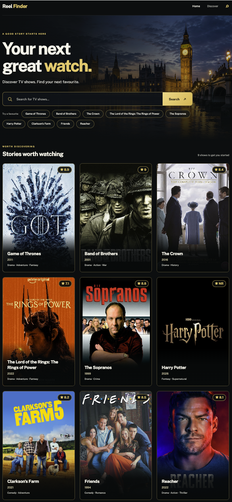

# Reel Finder

Search TV shows, browse their details, and find something worth watching. Reel Finder pairs a cinematic London backdrop with a searchable TVmaze catalog, poster cards, ratings, and a selection of quick searches.

**[Open Reel Finder](http://13.134.213.148)** · [Deployment workflow](https://github.com/andriysmyk/reel_finder/actions/workflows/deploy.yml)

The public deployment currently uses HTTP and an Elastic IP. A domain and HTTPS are not configured yet.

<p align="center">
  
</p>

## What it does

- Searches show titles and keeps the query in the URL so results can be shared.
- Displays posters, premiere years, genres, and ratings from TVmaze.
- Opens a details page with a synopsis, language, runtime, and show status.
- Returns to the previous search from the details page.
- Provides quick searches and an initial selection of shows.
- Handles missing posters, empty results, loading, and upstream errors. Initial suggestions still load if an individual show request fails.
- Adjusts the layout for desktop and mobile, with keyboard focus styles and reduced-motion support.

This is a TV show catalog. It does not host video or provide streaming playback. External official-site links come from TVmaze and may require a subscription or be unavailable in some regions.

## How it runs

The frontend and API routes run in one Next.js application. The browser calls the local API; the server fetches and normalizes TVmaze responses. No database or TVmaze API key is required.

```text
Browser
   │ HTTP :80
   ▼
EC2 · Docker · Next.js
   ├── /                 Search and featured shows
   ├── /shows/:id        Show details
   ├── /api/search       Title search ────┐
   ├── /api/shows/:id    Show lookup ─────┴──▶ TVmaze API
   └── /api/health       Version and uptime
          │
          └── JSON application logs → CloudWatch

GitHub Actions ──OIDC──▶ IAM deployment role
   ├── Build image → ECR, tagged with the commit SHA
   └── SSM Run Command → EC2 pulls and restarts the container
```

| Layer | Implementation |
| --- | --- |
| Application | Next.js 16, React 19, TypeScript |
| Styling | CSS with responsive layouts; Public Sans |
| Show data | Public TVmaze API |
| Runtime | Node.js 22, multi-stage Docker image |
| Infrastructure | Terraform, EC2, ECR, Elastic IP, CloudWatch Logs |
| Deployment | GitHub Actions, OIDC, AWS Systems Manager |

## Run locally

Use Node.js 22 and npm.

```bash
npm ci
npm run dev
```

Open [localhost:3000](http://localhost:3000). The app needs an internet connection to load TVmaze data and remote posters.

```bash
npm run typecheck
npm run build
```

`npm run dev` is the local preview command. Restart a production server after rebuilding; an existing process can reference assets from the previous build.

To run the production image:

```bash
docker build -t reel_finder .
docker run --rm -p 3000:3000 -e APP_VERSION=local reel_finder
```

The image uses Next.js standalone output, runs as a non-root user, and includes a health check. The banner is stored locally at `public/images/london-hero.png`; posters are loaded from TVmaze.

| Environment variable | Default | Purpose |
| --- | --- | --- |
| `APP_VERSION` | `dev` | Version returned by the health endpoint and included in logs |
| `TVMAZE_BASE_URL` | `https://api.tvmaze.com` | Upstream API base URL; can be overridden to check failure handling |

## API

| Request | Successful response | Error responses |
| --- | --- | --- |
| `GET /api/search?q=Reacher` | `{ query, results }` | `400` for queries shorter than two characters |
| `GET /api/shows/43031` | Show details | `400` for an invalid ID, `404` for a missing show |
| `GET /api/health` | `{ status, version, uptimeSeconds }` | — |

Upstream requests have a five-second timeout and a one-hour Next.js revalidation interval. The API maps connection failures to `502`, rate limits to `503`, and timeouts to `504`. HTML is removed from TVmaze summaries before they are displayed.

```bash
curl -i 'http://localhost:3000/api/search?q=Reacher'
curl 'http://localhost:3000/api/health'
```

## Deploy an application update

Infrastructure is already provisioned for the linked deployment. Changes to application code, CSS, or public assets do not require `terraform apply`.

1. Run the type check and production build.
2. Commit the application changes and push to `main`.
3. Follow the run in GitHub Actions.
4. Check the public `/api/health` endpoint. Its `version` should match the deployed commit SHA.

Pull requests run type checking and a production build. Deployment runs on pushes to `main`, or a manual workflow run on `main`, after those checks pass. The job uses the GitHub `production` environment.

The deployment obtains temporary AWS credentials through OIDC, builds a Docker image, and pushes it to ECR with an immutable commit-SHA tag. If that image already exists, the build is skipped. SSM then pulls the image on EC2 and replaces the running container. A smoke test checks that the public health endpoint reports the new version.

Replacing the container causes a brief interruption; this deployment does not provide rolling updates. ECR retains the latest ten images.

## Provision infrastructure

For a new AWS deployment, configure AWS CLI credentials, install Terraform, and edit the repository settings in the example file:

```bash
cd infra
cp terraform.tfvars.example terraform.tfvars
terraform init
terraform plan
terraform apply
terraform output
```

Set `create_oidc_provider = false` if the account already has the GitHub OIDC provider. For GitHub repositories using immutable OIDC subjects, set `github_oidc_subject` to the exact subject including owner and repository IDs. The example contains this repository's value; change it when deploying a fork. CloudTrail records rejected subjects under `userIdentity.userName` in `AssumeRoleWithWebIdentity` events.

Create a GitHub environment named `production` and set these environment variables from `terraform output`:

| GitHub variable | Used for |
| --- | --- |
| `AWS_REGION` | AWS API requests |
| `AWS_DEPLOY_ROLE_ARN` | OIDC role assumption |
| `ECR_REPOSITORY` | Docker image repository |
| `EC2_INSTANCE_ID` | SSM deployment target |
| `LOG_GROUP` | Container logging |
| `APP_URL` | Public deployment smoke test |

No long-lived AWS access keys are stored in GitHub. Terraform state, local `.tfvars`, and `.terraform` directories remain outside Git and the Docker build context. Keep `.terraform.lock.hcl` in version control.

The instance uses IMDSv2 and an encrypted 20 GB gp3 root volume. Inbound HTTP is allowed; SSH is closed. The instance role provides SSM access, ECR reads, and writes to the application log group. The deployment role is scoped to this repository's `production` environment, one ECR repository, and the EC2 deployment target.

## Operations

Application logs are JSON and include timestamp, severity, version, and request context. In CloudWatch Logs Insights, select `/reel_finder/app` and query recent errors:

```text
fields @timestamp, @message
| filter @message like /"level":"error"/
| sort @timestamp desc
| limit 20
```

Log retention is 14 days. The public health endpoint reports process uptime and version; it does not probe TVmaze availability.

If deployment fails, check the failed Actions step and the SSM command output. To redeploy the same commit, rerun the workflow. To undo a code change, revert it and push the revert to `main`. The workflow currently deploys only `main`; selecting another branch for a manual run does not deploy it.

EC2, EBS, the public IPv4 address, ECR storage, and CloudWatch can incur charges. Remove the managed infrastructure when it is no longer needed:

```bash
cd infra
terraform plan -destroy
terraform destroy
```

This removes the deployment and its managed resources, including stored ECR images. Preserve anything you need before destroying it.

## Repository layout

```text
app/
  Marquee.tsx             Header and navigation
  SearchView.tsx          Search, quick searches, featured cards, UI states
  globals.css             Shared styles and responsive layouts
  shows/[id]/page.tsx      Show details
  api/                    Search, details, and health routes
lib/
  tvmaze.ts               Upstream client and response mapping
  http.ts                 HTTP error handling
  log.ts                  Structured logging
  types.ts                API types
public/images/            Local banner assets
infra/                    Terraform configuration
.github/workflows/        CI and deployment
Dockerfile                Production image
```

## Credits

Show information and posters are supplied by [TVmaze](https://www.tvmaze.com/api). The London banner was generated for this application. Reel Finder is an independent catalog and is not affiliated with the listed shows or streaming services.
